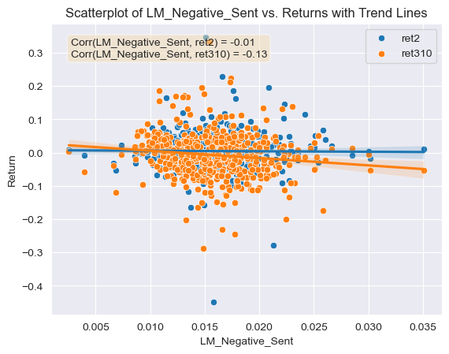

```python
import fnmatch
import glob
import os
import re
from time import sleep
from zipfile import ZipFile
from io import BytesIO
from urllib.request import urlopen
import matplotlib.pyplot as plt
import seaborn as sns 

import numpy as np
import pandas as pd
import pyreadstat as pystat
from bs4 import BeautifulSoup
from near_regex import NEAR_regex  # copy this file into the asgn folder
from tqdm import tqdm  # progress bar on loops

from sec_edgar_downloader import Downloader
from tqdm import tqdm
import warnings
warnings.filterwarnings("ignore", message="It looks like you're parsing an XML document using an HTML parser")

from bs4 import BeautifulSoup
```


```python
df = pd.read_csv("output/analysis_sample.csv")
```

# Project Report

## Summary

The purpose of this project is to analyze how firm performance post 10-K filing publication for firms in the S&P500 index is affected by the sentiment score of their respective 10-K filing. This analysis is conducted by comparing positive and negative sentiment scores for the 10-Ks and how these scores are correlated with the cumulative returns on the two days since the release and between the third and tenth day since the release. I personally hypothesize that the 10-Ks which score highly on negative sentiment and poorly on positive sentiment will see lower returns than those whose low negative sentiment scores and high positive sentiment scores. In other words, I think that the correlation between negative sentiment variables and low returns should be high, while the correlation between positive sentiment scores and high returns to be high. 

## Data

### Data Introduction
The sample of data that I am working with is called analysis_sample.csv which can be found in the output folder of the repository. Every row in this data set pertains to an individual firm which is part of the S&P500 index, and the columns contain information regarding this given firm. The first column pertains to the date of the filing of the firm's 10-K. Some of the columns in the data set pertain to accounting and financial metrics for the year 2021, which is the data that is reported on the 10-Ks released on 2022. Other columns pertain to the cumulative returns observed in 2022, for certain time-frames after the 10-K filing is released. The rest of the columns pertain to sentiment calculations for the 10-Ks of the firms, these sentiment calculations are computed using different dictionaries of positive and negative words to calculate the relative positive/negative sentiment of the 10-K filings. See below for more details on return and sentiment variables. 

### Calculating Returns
It is first necessary to explain how the two return variables are calculated and how I derive them. In first place, the source of the data set used to calculate returns is CRSP (Center for Research in Security Prices) for the year 2022. This dataset is then filtered to only include returns for firms that are part of the S&P500 dataset. Once the dataset is filtered, the cumulative returns around the 10-K filing date are calculated. To do this I first use another dataset which contains the exact filing date for a given firm. I loop through this dataset and subset the returns dataset so that the subset only contains rows for the given firm and returns for dates starting at the filing date and moving forward. The first return variable is then calculated, by getting the cumulative product of the returns for the firm on the day of the filing and the following two business days, so if t is the day of the filing the cumulative return is calculated between t and t+2. The second cumulative return variable is also dependent on the release of the filing date, but in this case the cumulative return is calculated by getting the product of the returns between t+3 and t+10 (remember that t is the filing date), so for a longer time frame.

### Calculating Sentiment Scores and Contextual Sentiment Scores
It is also necessary to explain how the sentiment score variables were calculated. The first step in this process was to download the different 10-Ks for 2022 from the SEC for the firms in the S&P500 which released a 10-K. These 10-Ks were in an html format and were all passed through an algorithm which cleaned the html file and turned them into a usable text file for analysis. In principle the cleaning involved removing any html tags, removing any punctuation and making everything lower case. These cleaned text files were then put into a dataset which is then used to calculate sentiment scores. The first two sentiment scores are calculated according to what is referred to in this project as the ML dictionary, which is derived from the a paper called "The color of finance words" released in the Journal of Financial Economics by Garcia, Hu and Rohrer. This dictionary contains a list of words that can be considered to give a positive association to a 10-K or that can be considered to give a negative association to a 10-K. The two different lists (negative/positive words) are then assembled into a regex expression. This regex expression is then used to calculate the number of times that a word from the dictionaries are included in the 10-K, which is divided by the total number of words in the 10-K document to arrive to the positive/negative sentiment scores. The next two sentiment variables are calculated using a different dictionary of positive/negative words, in this project this dictionary is referred to as LM_dictionary, which is derived from a paper called "When is a Liability not a Liability? Textual Analysis, Dictionaries, and 10-Ks" published in the Journal of Finance by Tim Loughran and Bill McDonald. The process to calculate the sentiment score is the same as for the above dictionary. The next six sentiment variables are contextual and dependent upon different topics. The topic chosen are competition, regulation, and inflation, and the positive and negative contextual sentiment score is calculated for the three topics. For each topic a list of words that are synonyms or very closely associated with the topic is developed. This list is passed through a regex function which produces a regex expression that serves to look for the given words. Then, in order to calculate the positive/negative sentiment around these topics, the regex expressions from the ML dictionary are used to see if the given 10-K talks in a positive or negative manner about the topic.

The competition topic was selected for the contextual sentiment analysis because I thought that this is one of the most important metrics when analyzing a firm's success and performance. If a firm is able to talk positively about its position relative to its competitors in their respective market then one could expect for investors to have a good feeling about the future success of the company. This would in turn increase the demand for a firm's security and increase its returns. The inverse would happen if a firm talked about its competitive positioning in a negative manner. The regulation topic was chosen on a similar basis. Many firms are under great stress due to regulatory requirements, sometimes in a positive manner and other in a negative manner. For example if a firm is facing regulatory scrutiny by government agencies, they are required to mention this in the 10-K under risk factors, and will talk about it in a negative manner, for that reason investors fearing that the outcome of this regulatory scrutiny might hurt the firm will push investors away and lead to lower returns on the stock. A similar phenomena will take place if a firm has been following all regulation requirements and is under no stress in this matter. The inflation topic was mainly chosen given the current macroeconomic state of the world. Some firms might be more vulnerable to inflation and interest rate increases due to it. Like oil companies or banks. These kind of firms will probably mention this under the risk factors of the filing which could push investors away and have a negative effect on share price and returns.

### Dataset statistical analysis


```python
df[['ret2', 'ret310', 'ML_Negative_Sent', 'ML_Positive_Sent', 'LM_Negative_Sent', 'LM_Positive_Sent', 'Comp_Negative_Sent', 'Comp_Positive_Sent', 'Reg_Negative_Sent', 'Reg_Positive_Sent', 'Infl_Negative_Sent', 'Infl_Positive_Sent']].describe()
```


<div>
<style scoped>
    .dataframe tbody tr th:only-of-type {
        vertical-align: middle;
    }

    .dataframe tbody tr th {
        vertical-align: top;
    }

    .dataframe thead th {
        text-align: right;
    }
</style>
<table border="1" class="dataframe">
  <thead>
    <tr style="text-align: right;">
      <th></th>
      <th>ret2</th>
      <th>ret310</th>
      <th>ML_Negative_Sent</th>
      <th>ML_Positive_Sent</th>
      <th>LM_Negative_Sent</th>
      <th>LM_Positive_Sent</th>
      <th>Comp_Negative_Sent</th>
      <th>Comp_Positive_Sent</th>
      <th>Reg_Negative_Sent</th>
      <th>Reg_Positive_Sent</th>
      <th>Infl_Negative_Sent</th>
      <th>Infl_Positive_Sent</th>
    </tr>
  </thead>
  <tbody>
    <tr>
      <th>count</th>
      <td>492.000000</td>
      <td>492.000000</td>
      <td>494.000000</td>
      <td>494.000000</td>
      <td>494.000000</td>
      <td>494.000000</td>
      <td>494.000000</td>
      <td>494.000000</td>
      <td>494.000000</td>
      <td>494.000000</td>
      <td>494.000000</td>
      <td>494.000000</td>
    </tr>
    <tr>
      <th>mean</th>
      <td>0.004931</td>
      <td>-0.007008</td>
      <td>0.025476</td>
      <td>0.023490</td>
      <td>0.015819</td>
      <td>0.004927</td>
      <td>0.000110</td>
      <td>0.000103</td>
      <td>0.000810</td>
      <td>0.000374</td>
      <td>0.000107</td>
      <td>0.000053</td>
    </tr>
    <tr>
      <th>std</th>
      <td>0.054322</td>
      <td>0.066163</td>
      <td>0.003699</td>
      <td>0.004115</td>
      <td>0.003885</td>
      <td>0.001380</td>
      <td>0.000084</td>
      <td>0.000075</td>
      <td>0.000368</td>
      <td>0.000184</td>
      <td>0.000099</td>
      <td>0.000058</td>
    </tr>
    <tr>
      <th>min</th>
      <td>-0.447499</td>
      <td>-0.288483</td>
      <td>0.008953</td>
      <td>0.003530</td>
      <td>0.002541</td>
      <td>0.000272</td>
      <td>0.000000</td>
      <td>0.000000</td>
      <td>0.000000</td>
      <td>0.000000</td>
      <td>0.000000</td>
      <td>0.000000</td>
    </tr>
    <tr>
      <th>25%</th>
      <td>-0.023298</td>
      <td>-0.047876</td>
      <td>0.023559</td>
      <td>0.021511</td>
      <td>0.013218</td>
      <td>0.004006</td>
      <td>0.000048</td>
      <td>0.000046</td>
      <td>0.000552</td>
      <td>0.000248</td>
      <td>0.000042</td>
      <td>0.000014</td>
    </tr>
    <tr>
      <th>50%</th>
      <td>0.002878</td>
      <td>-0.006860</td>
      <td>0.025689</td>
      <td>0.023888</td>
      <td>0.015555</td>
      <td>0.004845</td>
      <td>0.000093</td>
      <td>0.000089</td>
      <td>0.000750</td>
      <td>0.000336</td>
      <td>0.000083</td>
      <td>0.000038</td>
    </tr>
    <tr>
      <th>75%</th>
      <td>0.030325</td>
      <td>0.029665</td>
      <td>0.027572</td>
      <td>0.025922</td>
      <td>0.017884</td>
      <td>0.005646</td>
      <td>0.000158</td>
      <td>0.000143</td>
      <td>0.000973</td>
      <td>0.000455</td>
      <td>0.000138</td>
      <td>0.000072</td>
    </tr>
    <tr>
      <th>max</th>
      <td>0.348567</td>
      <td>0.332299</td>
      <td>0.038030</td>
      <td>0.037982</td>
      <td>0.035088</td>
      <td>0.010899</td>
      <td>0.000510</td>
      <td>0.000422</td>
      <td>0.002541</td>
      <td>0.001175</td>
      <td>0.000637</td>
      <td>0.000399</td>
    </tr>
  </tbody>
</table>
</div>


Summary statistics for the dataset used in the project are shown above. Starting first with the return variable for the first two days since the release of the 10-K, it is seen that the mean return after 10-K release is equal to 0.5%, generally a good sign that investors tend to demand more of a stock after the 10-K release. Looking now at the extremes for this variable it is apparent that the greatest share price increase was 34%, meaning that the 10-K gave pretty good signs of the state of the given firm, conversely, the minimum return was -44%, probably meaning that the 10-K gave light to very negative information about a given firm. Regarding the second return variable which looks at returns over a longer time frame it is interesting to notice that on average firms tend to under-perform with a -0.7%. The max return (33%) is also smaller than the cumulative max return in the shorter time-frame. Nevertheless the minimum return (-28%) on the longer time frame is greater than that of the shorter time-frame. Regarding the negative sentiment of the 10-Ks according to the ML dictionary it is interesting to note that on average 10-Ks are slightly more negative than positive (2.5% vs 2.3%), along these lines the minimum negative sentiment is greater than the minimum positive sentiment. The max positive and negative sentiment according to the ML dictionary is nevertheless very similar. Looking now at the sentiment scores for the LM dictionary, it can be seen that the mean negative sentiment is also greater than the mean positive sentiment (1.5% vs 0.5%), the max for the negative sentiment is also greater than the max for the positive sentiment using the LM dictionary.

Overall, looking at the sentiment score outputs and their statistical data as seen above, it could be said that they can be used for further analysis and drawing conclusions. It seems like most of the time the values for these are non-zero and not the same value either, despite these being considerably low, which could arise from the specificity of the contextual topics being used.

### Possible Caveats
On the other hand, one of the possible caveats that arise from this dataset is the fact that the contextual sentiment scores are extremely low. This could mean that the topic is not mentioned enough in a positive/negative manner to be able to draw conclusions from the data. Another possible caveat is that there are some firms that don't have any accounting data and further analysis for those firms using this dataset would not be feasable. 

## Results
**The figures referred to throughout this section can be found in the appendix of this report (see below for the Appendix)**

1. Comparison of the relationship of ML Sentiment Scores (positive and negative) and the first return variable and the relationship of LM Sentiment Scores (positive and negative) and the first return variable. 

This analysis involves the Figures 2-5. In first place looking at the correlation coefficient of the ML Negative sentiment score against the first return variable (Figure 2), it can be seen that it is of 0.05, meaning that returns around 10-K filing dates will increase very slightly when the Negative sentiment score increases. Looking now at the relationship between the Positive Sentiment scores using the ML dictionary and the first return variable, the correlation is of 0.03 (Figure 3). Just like for the ML Negative scores returns will increase as positive sentiment scores increases. Nevertheless, the correlation between Negative ML scores is greater than that of Positive ML scores, meaning that a firm's return will increase by a slightly greater amount the greater the Negative Sentiment score using the ML dictionary is. This initial comparison goes against what I initially hypothesized, as I thought that greater positive scores would have a greater relationship with higher returns than greater negative scores. 

Looking now at this same relationship but for the LM dictionary. It can be seen that there is a -0.01 correlation between the LM negative sentiment variables and the first return variable (Figure 4), meaning that firms who have a larger negative sentiment score according to the LM dictionary will also see returns reduced shortly after the 10-K filing. In the same manner, the correlation between positive sentiment scores using the LM dictionary and the first return variable is of -0.09 (Figure 5), again meaning that firms who have a larger positive sentiment score according to the LM dictionary will also see returns reduced shortly after the 10-K filing. This is also surprising to me as it means that 10-Ks which score higher on positive sentiment than negative sentiment using the LM dictionary will tend to see their returns reduced by a larger amount.   

Comparing both of the dictionaries negative and positive correlations to the first return variable they agree on the same general trends; the higher negative sentiment scores using either dictionary will generally lead to higher returns (or not as great of a return reduction) shortly after the 10-K filing. Nevertheless, one key difference between these is that when using the ML dictionary to calculate sentiment scores the trend observed after the 10-K filing is a bullish one, given that both the negative and positive correlations with the first return variables are positive. This effect is reversed if the LM dictionary is used, the correlation between the negative and positive sentiment scores are negatively correlated to the first return variable.  

2. Results Comparison with Table 3 of the Garcia, Hu, and Rohrer paper

Looking at Table 3 from the Garcia, Hu and Rohrer. It can be seen that the relationship between the return variable around 10-K filing date for the LM positive dictionary is of -0.14 and the correlation coefficient that I developed is of approximately -0.09. Even though magnitudes differ in this case, both cases show the same trend that higher positive sentiment scores using the LM dictionary will lead to lower returns. For the LM negative dictionary relationship with the return variable, the table from the paper shows a coefficient of -0.06. In my case I got a correlation coefficient of -0.01 for this same dictionary, and even though the magnitudes are different, both agree on the trend that higher negative scores will also lead to lower returns. This means that for the LM dictionary both the paper and I agree on the trends observed that 10-Ks which score higher on positive sentiment than negative sentiment using the LM dictionary will tend to see their returns reduced by a larger amount.

Looking now at the coefficients reported on the paper's table for the ML dictionaries, it can be observed that the coefficient for the positive ML dictionary is of 0.11, in my case the correlation coefficient between the returns around 10-K filing dates and sentiment scores using the positive ML dictionary is of 0.03 approximately. In this context we both again agree on the trend that returns will increase as positive sentiment scores increase. The first difference observed between the table's data and mine is that the table shows a coefficient of -0.05 for the relationship between the ML Negative sentiment scores and post filing date returns, while my correlation coefficient for these variables is precisely the opposite, 0.05. This means that the trends observed for this specific dictionary conflict. The paper shows that for firms who score highly on positive sentiment using the ML dictionary will see higher returns, and the opposite will happen if they score highly for negative sentiment using the ML dictionary. The trend I observed in my case is that filings that score higher on negative sentiment for the 10-Ks will tend to see a greater return increase around the filing date than firms which score highly on positive sentiment. 

All my four correlation coefficients agree on the same general trend that the higher negative sentiment scores using either dictionary will generally lead to higher returns. Nevertheless, in the paper this is only true when using the LM dictionary to calculate sentiments. When using the ML dictionary the trend observed in the paper is reversed, high positive sentiment scores will lead to higher returns. This conflict in trends observed could be due to a number of reasons. One of the reasons could be the amount of data they built the model on, while I only used firms in the S&P500 firms, they used 10,076 firms. The time frame they used is also much greater and different than mine, while I only conducted the study for the year 2022, they did so between the years 1996 and 2018. Another reason for this difference could be the complexity of the model, while they have used a regression model to calculate relationships between the variables with many control variables, I have only calculated simple correlations between the variables. Although this is improbable, this could also be due to an error in my code when calculating sentiment scores or cumulative returns.   

3. Contextual Sentiment Measures

Regarding the contextual sentiment measures and their relationship with the returns, they all produce correlation coefficients which are far enough from 0 and could be used for further analysis. All of the relationship values are similar or even greater in magnitude than the correlation coefficients calculated for the ML and LM negative and positive dictionaries. This is a good sign that the contextual sentiment variables were calculated correctly. For example, the correlation coefficients between the first return variable and the positive and negative competition contextual sentiment scores were very similar, approximately -0.05 (Figures 6 and 7). This means that any mention of competition can be viewed in a negative manner by investors given the negative correlation with returns. This kind of information could be used by firms which think that mentioning a positive aspect about their competitive environment in the 10-K will help their security's return. This same phenomena is observed for the regulation contextual sentiment topic, both the negative and positive sentiment variables have a negative relation with the first return variable, -0.022 and -0.038 respectively (Figures 8 and 9). Again this could mean that any mention of regulation (positive or negative) carries negative connotations for investors, and could make them reluctant to buying the stock or push them towards a sale of it. Even though a firm facing regulatory scrutiny from government agencies can't keep out this information from a 10-K disclosure, firms that are not could avoid mentioning this topic in a positive manner (investors could be thinking that the firm is trying to hide some kind of information). Regarding the inflation contextual sentiment topic, the correlation coefficients with the return variable are significantly different, the negative score correlation is of 0.014 and the positive correlation coefficient is of -0.015 (Figures 10 and 11). This could mean that firms who see inflation in a positive way for the business are seen as trying to deceive investors, which results in poor post filing stock performance. On the other hand firms that mention inflation in a negative way, are seen as honest and aware of the harsh reality of the current macroeconomic environment. This information could be used by firms as it highlights the importance of releasing truthful, honest and reality-adhering disclosures. 

4. Relationship between ML sentiment variables and the two return variables

The positive and negative ML sentiment variables are related to both of the return variables in different ways. For example the negative sentiment using the ML dictionary has a correlation with the first return variable of 0.054 for the second return variable which looks at a longer time frame it has a correlation of 0.016. Even though they both display positive correlations, the magnitude of the correlations are quiet different. This could be because for a longer time frame, other factors rather than just the sentiment of the 10-K might be factored into the pricing of a given stock, for example new economic conditions, or a recent statement by a government agency like the Fed. This is why the magnitude of the correlation for the second return variable is smaller with the ML negative sentiment variable. Regarding the correlations for the ML positive sentiment variable and the returns, there is a major difference in magnitude and sign. For the first return variable the correlation with the ML positive sentiment is of 0.025 but for the second return variable it is of -0.032. I believe that the reason for the discrepancy in the sign of the correlation is the same as the one mentioned for the ML negative dictionary variable. The longer the time frame, the greater the uncertainty and the more factors that could have an effect on the stock price. The fact that the magnitude of the correlation for the second return variable is greater than the first one is also interesting and contradicts my argument that a longer time frame will lead to a reduced correlation. This could also be because not all investors read and analyze the 10-Ks right after the filing and might wait a couple more days to come up with an investment decision, hence the higher correlation with the longer time frame return variable.  

## Conclusions and Findings
Restating my initial hypothesis: "I think that the correlation between negative sentiment variables and low returns should be high, while the correlation between positive sentiment scores and high returns to be high." After analyzing the developed figures it is clear that this was in fact not the case. According to the analysis run above and my correlation calculations, there is a general trend that goes against my initial hypothesis. Focusing on the first return variable, there is a clear trend that a firms whose 10-K filings negative sentiment scores using both the ML and LM dictionaries will tend to see higher returns than firms who score highly on positive sentiment shortly after the filing release. The specific reasons for this phenomena could be hypothesized, and further analysis could be conducted on this matter. I also found that the correlations between the first return variable and the topics covered for the contextual sentiment variables could be used by firms when drafting up their 10-K filings to avoid seeing negative stock returns.

## Appendix

- **Figure 1:** Correlation Matrix (Heat Map)


```python
cols = ['ret2', 'ret310', 'ML_Negative_Sent', 'ML_Positive_Sent', 'LM_Negative_Sent', 'LM_Positive_Sent', 'Comp_Negative_Sent', 'Comp_Positive_Sent', 'Reg_Negative_Sent', 'Reg_Positive_Sent', 'Infl_Negative_Sent', 'Infl_Positive_Sent']

# calculate the correlation matrix
corr_matrix = df[cols].corr()

# create a new dataframe with just the correlations for ret2 and ret310
ret_corr_df = pd.DataFrame({'ret2': corr_matrix['ret2'][2:],
                            'ret310': corr_matrix['ret310'][2:]})
sns.heatmap(ret_corr_df, annot = True)
```


    <AxesSubplot: >


    

    


- **Figure 2:** Scatter Plot of Negative Sentiment Scores (ML Dictionary) against return variables with correlations and trend lines


```python
# Scatterplot ML_Negative
x = 'ML_Negative_Sent'
y1 = 'ret2'
y2 = 'ret310'
# Calculate the correlation coefficient between x and y variables
corr_y1 = df[x].corr(df[y1])
corr_y2 = df[x].corr(df[y2])
# Create a scatterplot using seaborn
fig, ax = plt.subplots()
sns.scatterplot(data=df, x=x, y=y1, label=y1, ax=ax)
sns.scatterplot(data=df, x=x, y=y2, label=y2, ax=ax)
sns.regplot(data=df, x=x, y=y1, scatter=False, ax=ax)
sns.regplot(data=df, x=x, y=y2, scatter=False, ax=ax)
sns.set_style('darkgrid')
plt.xlabel('ML_Negative_Sent')
plt.ylabel('Return')
plt.title('Scatterplot of ML_Negative_Sent vs. Returns with Trend Lines')
# Add correlation coefficient to the plot
textstr = f'Corr({x}, {y1}) = {corr_y1:.2f}\nCorr({x}, {y2}) = {corr_y2:.2f}'
props = dict(boxstyle='round', facecolor='wheat', alpha=0.5)
ax.text(0.05, 0.95, textstr, transform=ax.transAxes, fontsize=10,
        verticalalignment='top', bbox=props)
plt.legend()
plt.show()
```


    

    


- **Figure 3:** Scatter Plot of Positive Sentiment Scores (ML Dictionary) against return variables with correlations and trend lines


```python
# Scatterplot ML_Positive
x = 'ML_Positive_Sent'
y1 = 'ret2'
y2 = 'ret310'
# Calculate the correlation coefficient between x and y variables
corr_y1 = df[x].corr(df[y1])
corr_y2 = df[x].corr(df[y2])
# Create a scatterplot using seaborn
fig, ax = plt.subplots()
sns.scatterplot(data=df, x=x, y=y1, label=y1, ax=ax)
sns.scatterplot(data=df, x=x, y=y2, label=y2, ax=ax)
sns.regplot(data=df, x=x, y=y1, scatter=False, ax=ax)
sns.regplot(data=df, x=x, y=y2, scatter=False, ax=ax)
sns.set_style('darkgrid')
plt.xlabel('ML_Positive_Sent')
plt.ylabel('Return')
plt.title('Scatterplot of ML_Positive_Sent vs. Returns with Trend Lines')
# Add correlation coefficient to the plot
textstr = f'Corr({x}, {y1}) = {corr_y1:.2f}\nCorr({x}, {y2}) = {corr_y2:.2f}'
props = dict(boxstyle='round', facecolor='wheat', alpha=0.5)
ax.text(0.05, 0.95, textstr, transform=ax.transAxes, fontsize=10,
        verticalalignment='top', bbox=props)
plt.legend()
plt.show()
```


    

    


- **Figure 4:** Scatter Plot of Negative Sentiment Scores (LM Dictionary) against return variables with correlations and trend lines


```python
# Scatterplot LM_Negative
x = 'LM_Negative_Sent'
y1 = 'ret2'
y2 = 'ret310'
# Calculate the correlation coefficient between x and y variables
corr_y1 = df[x].corr(df[y1])
corr_y2 = df[x].corr(df[y2])
# Create a scatterplot using seaborn
fig, ax = plt.subplots()
sns.scatterplot(data=df, x=x, y=y1, label=y1, ax=ax)
sns.scatterplot(data=df, x=x, y=y2, label=y2, ax=ax)
sns.regplot(data=df, x=x, y=y1, scatter=False, ax=ax)
sns.regplot(data=df, x=x, y=y2, scatter=False, ax=ax)
sns.set_style('darkgrid')
plt.xlabel('LM_Negative_Sent')
plt.ylabel('Return')
plt.title('Scatterplot of LM_Negative_Sent vs. Returns with Trend Lines')
# Add correlation coefficient to the plot
textstr = f'Corr({x}, {y1}) = {corr_y1:.2f}\nCorr({x}, {y2}) = {corr_y2:.2f}'
props = dict(boxstyle='round', facecolor='wheat', alpha=0.5)
ax.text(0.05, 0.95, textstr, transform=ax.transAxes, fontsize=10,
        verticalalignment='top', bbox=props)
plt.legend()
plt.show()
```


    

    


- **Figure 5:** Scatter Plot of Positive Sentiment Scores (LM Dictionary) against return variables with correlations and trend lines


```python
# Scatterplot LM_Positive
x = 'LM_Positive_Sent'
y1 = 'ret2'
y2 = 'ret310'

# Calculate the correlation coefficient between x and y variables
corr_y1 = df[x].corr(df[y1])
corr_y2 = df[x].corr(df[y2])

# Create a scatterplot using seaborn
fig, ax = plt.subplots()
sns.scatterplot(data=df, x=x, y=y1, label=y1, ax=ax)
sns.scatterplot(data=df, x=x, y=y2, label=y2, ax=ax)
sns.regplot(data=df, x=x, y=y1, scatter=False, ax=ax)
sns.regplot(data=df, x=x, y=y2, scatter=False, ax=ax)
sns.set_style('darkgrid')
plt.xlabel('LM_Positive_Sent')
plt.ylabel('Return')
plt.title('Scatterplot of LM_Positive_Sent vs. Returns with Trend Lines')

# Add correlation coefficient to the plot
textstr = f'Corr({x}, {y1}) = {corr_y1:.2f}\nCorr({x}, {y2}) = {corr_y2:.2f}'
props = dict(boxstyle='round', facecolor='wheat', alpha=0.5)
ax.text(0.05, 0.95, textstr, transform=ax.transAxes, fontsize=10,
        verticalalignment='top', bbox=props)
plt.legend()
plt.show()
```


    

    


- **Figure 6:** Scatter Plot of Negative Sentiment Scores for **Competition** topic (ML Dictionary) against return variables with correlations and trend lines


```python
# Scatterplot Competition_Negative
x = 'Comp_Negative_Sent'
y1 = 'ret2'
y2 = 'ret310'

# Calculate the correlation coefficient between x and y variables
corr_y1 = df[x].corr(df[y1])
corr_y2 = df[x].corr(df[y2])

# Create a scatterplot using seaborn
fig, ax = plt.subplots()
sns.scatterplot(data=df, x=x, y=y1, label=y1, ax=ax)
sns.scatterplot(data=df, x=x, y=y2, label=y2, ax=ax)
sns.regplot(data=df, x=x, y=y1, scatter=False, ax=ax)
sns.regplot(data=df, x=x, y=y2, scatter=False, ax=ax)
sns.set_style('darkgrid')
plt.xlabel('Comp_Negative_Sent')
plt.ylabel('Return')
plt.title('Scatterplot of Comp_Negative_Sent vs. Returns with Trend Lines')

# Add correlation coefficient to the plot
textstr = f'Corr({x}, {y1}) = {corr_y1:.2f}\nCorr({x}, {y2}) = {corr_y2:.2f}'
props = dict(boxstyle='round', facecolor='wheat', alpha=0.5)
ax.text(0.05, 0.95, textstr, transform=ax.transAxes, fontsize=10,
        verticalalignment='top', bbox=props)
plt.legend()
plt.show()
```


    

    


- **Figure 7:** Scatter Plot of Positive Sentiment Scores for **Competition** topic (ML Dictionary) against return variables with correlations and trend lines


```python
# Scatterplot Competition_Positive
x = 'Comp_Positive_Sent'
y1 = 'ret2'
y2 = 'ret310'

# Calculate the correlation coefficient between x and y variables
corr_y1 = df[x].corr(df[y1])
corr_y2 = df[x].corr(df[y2])

# Create a scatterplot using seaborn
fig, ax = plt.subplots()
sns.scatterplot(data=df, x=x, y=y1, label=y1, ax=ax)
sns.scatterplot(data=df, x=x, y=y2, label=y2, ax=ax)
sns.regplot(data=df, x=x, y=y1, scatter=False, ax=ax)
sns.regplot(data=df, x=x, y=y2, scatter=False, ax=ax)
sns.set_style('darkgrid')
plt.xlabel('Comp_Positive_Sent')
plt.ylabel('Return')
plt.title('Scatterplot of Comp_Positive_Sent vs. Returns with Trend Lines')

# Add correlation coefficient to the plot
textstr = f'Corr({x}, {y1}) = {corr_y1:.2f}\nCorr({x}, {y2}) = {corr_y2:.2f}'
props = dict(boxstyle='round', facecolor='wheat', alpha=0.5)
ax.text(0.05, 0.95, textstr, transform=ax.transAxes, fontsize=10,
        verticalalignment='top', bbox=props)
plt.legend()
plt.show()
```


    

    


- **Figure 8:** Scatter Plot of Negative Sentiment Scores for **Regulation** topic (ML Dictionary) against return variables with correlations and trend lines


```python
# Scatterplot Regulation_Negative
x = 'Reg_Negative_Sent'
y1 = 'ret2'
y2 = 'ret310'

# Calculate the correlation coefficient between x and y variables
corr_y1 = df[x].corr(df[y1])
corr_y2 = df[x].corr(df[y2])

# Create a scatterplot using seaborn
fig, ax = plt.subplots()
sns.scatterplot(data=df, x=x, y=y1, label=y1, ax=ax)
sns.scatterplot(data=df, x=x, y=y2, label=y2, ax=ax)
sns.regplot(data=df, x=x, y=y1, scatter=False, ax=ax)
sns.regplot(data=df, x=x, y=y2, scatter=False, ax=ax)
sns.set_style('darkgrid')
plt.xlabel('Reg_Negative_Sent')
plt.ylabel('Return')
plt.title('Scatterplot of Reg_Negative_Sent vs. Returns with Trend Lines')

# Add correlation coefficient to the plot
textstr = f'Corr({x}, {y1}) = {corr_y1:.2f}\nCorr({x}, {y2}) = {corr_y2:.2f}'
props = dict(boxstyle='round', facecolor='wheat', alpha=0.5)
ax.text(0.05, 0.95, textstr, transform=ax.transAxes, fontsize=10,
        verticalalignment='top', bbox=props)
plt.legend()
plt.show()
```


    

    


- **Figure 9:** Scatter Plot of Positive Sentiment Scores for **Regulation** topic (ML Dictionary) against return variables with correlations and trend lines


```python
# Scatterplot Regulation_Positive 
x = 'Reg_Positive_Sent'
y1 = 'ret2'
y2 = 'ret310'

# Calculate the correlation coefficient between x and y variables
corr_y1 = df[x].corr(df[y1])
corr_y2 = df[x].corr(df[y2])

# Create a scatterplot using seaborn
fig, ax = plt.subplots()
sns.scatterplot(data=df, x=x, y=y1, label=y1, ax=ax)
sns.scatterplot(data=df, x=x, y=y2, label=y2, ax=ax)
sns.regplot(data=df, x=x, y=y1, scatter=False, ax=ax)
sns.regplot(data=df, x=x, y=y2, scatter=False, ax=ax)
sns.set_style('darkgrid')
plt.xlabel('Reg_Positive_Sent')
plt.ylabel('Return')
plt.title('Scatterplot of Reg_Positive_Sent vs. Returns with Trend Lines')

# Add correlation coefficient to the plot
textstr = f'Corr({x}, {y1}) = {corr_y1:.2f}\nCorr({x}, {y2}) = {corr_y2:.2f}'
props = dict(boxstyle='round', facecolor='wheat', alpha=0.5)
ax.text(0.05, 0.95, textstr, transform=ax.transAxes, fontsize=10,
        verticalalignment='top', bbox=props)
plt.legend()
plt.show()
```


    

    


- **Figure 10:** Scatter Plot of Negative Sentiment Scores for **Inflation** topic (ML Dictionary) against return variables with correlations and trend lines


```python
# Scatterplot Inflation_Negative
x = 'Infl_Negative_Sent'
y1 = 'ret2'
y2 = 'ret310'

# Calculate the correlation coefficient between x and y variables
corr_y1 = df[x].corr(df[y1])
corr_y2 = df[x].corr(df[y2])

# Create a scatterplot using seaborn
fig, ax = plt.subplots()
sns.scatterplot(data=df, x=x, y=y1, label=y1, ax=ax)
sns.scatterplot(data=df, x=x, y=y2, label=y2, ax=ax)
sns.regplot(data=df, x=x, y=y1, scatter=False, ax=ax)
sns.regplot(data=df, x=x, y=y2, scatter=False, ax=ax)
sns.set_style('darkgrid')
plt.xlabel('Infl_Negative_Sent')
plt.ylabel('Return')
plt.title('Scatterplot of Infl_Negative_Sent vs. Returns with Trend Lines')

# Add correlation coefficient to the plot
textstr = f'Corr({x}, {y1}) = {corr_y1:.2f}\nCorr({x}, {y2}) = {corr_y2:.2f}'
props = dict(boxstyle='round', facecolor='wheat', alpha=0.5)
ax.text(0.05, 0.95, textstr, transform=ax.transAxes, fontsize=10,
        verticalalignment='top', bbox=props)
plt.legend()
plt.show()
```


    

    


- **Figure 11:** Scatter Plot of Positive Sentiment Scores for **Inflation** topic (ML Dictionary) against return variables with correlations and trend lines


```python
# Scatterplot Inflation_Positive
x = 'Infl_Positive_Sent'
y1 = 'ret2'
y2 = 'ret310'

# Calculate the correlation coefficient between x and y variables
corr_y1 = df[x].corr(df[y1])
corr_y2 = df[x].corr(df[y2])

# Create a scatterplot using seaborn
fig, ax = plt.subplots()
sns.scatterplot(data=df, x=x, y=y1, label=y1, ax=ax)
sns.scatterplot(data=df, x=x, y=y2, label=y2, ax=ax)
sns.regplot(data=df, x=x, y=y1, scatter=False, ax=ax)
sns.regplot(data=df, x=x, y=y2, scatter=False, ax=ax)
sns.set_style('darkgrid')
plt.xlabel('Infl_Positive_Sent')
plt.ylabel('Return')
plt.title('Scatterplot of Infl_Positive_Sent vs. Returns with Trend Lines')

# Add correlation coefficient to the plot
textstr = f'Corr({x}, {y1}) = {corr_y1:.2f}\nCorr({x}, {y2}) = {corr_y2:.2f}'
props = dict(boxstyle='round', facecolor='wheat', alpha=0.5)
ax.text(0.05, 0.95, textstr, transform=ax.transAxes, fontsize=10,
        verticalalignment='top', bbox=props)
plt.legend()
plt.show()
```


    

    

